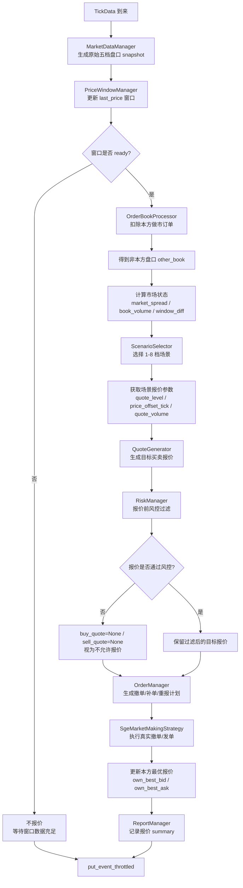
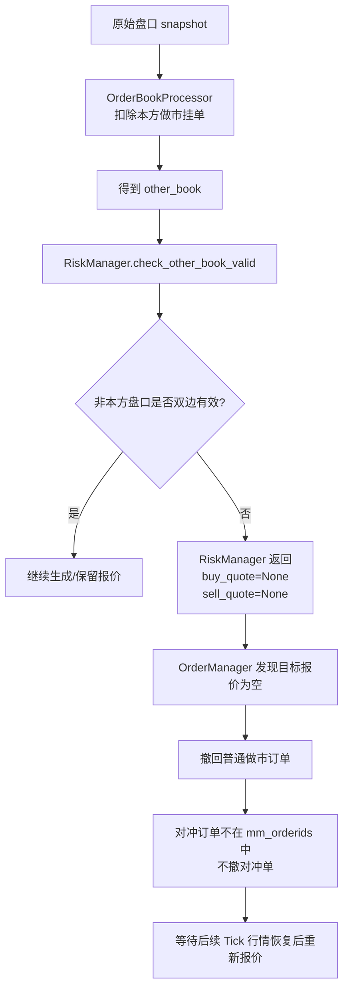
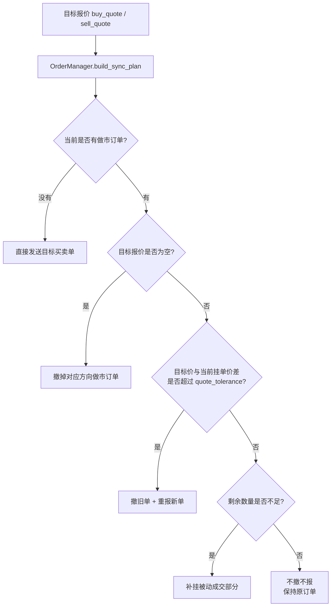
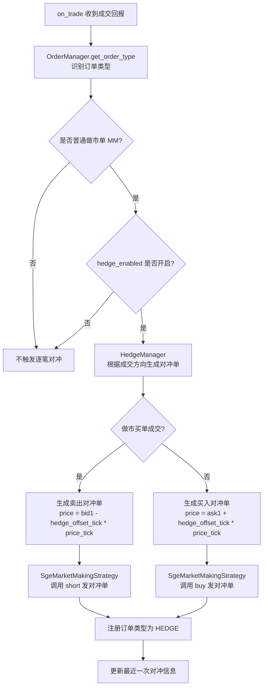
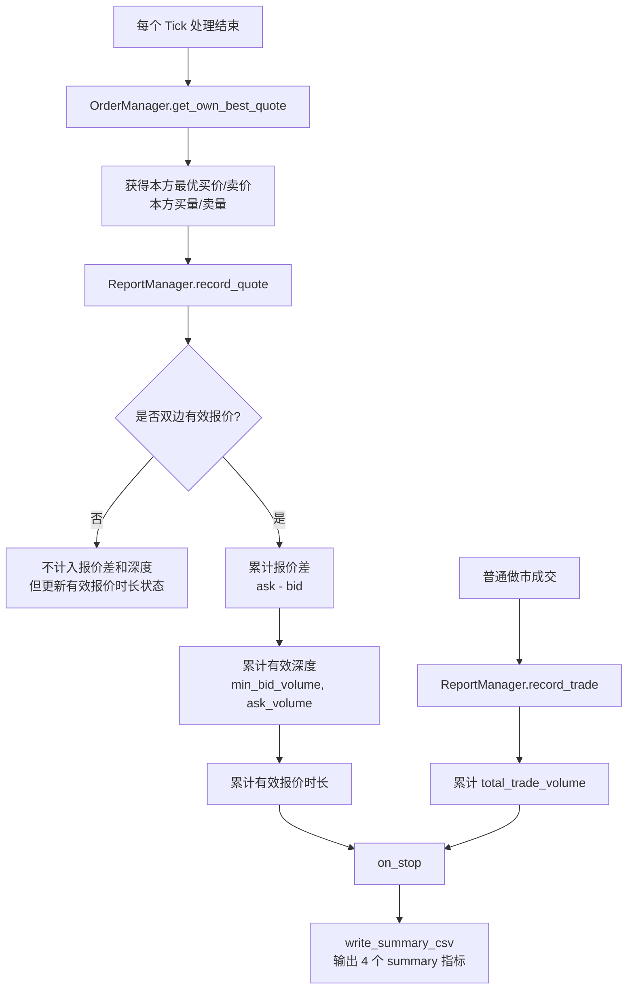

可以，你这个策略的链路图可以画成 **“行情驱动主链路 + 订单回报链路 + 成交对冲链路 + summary 统计链路”** 四条线。

---

## 1. 整体主流程链路图



这条主链路就是：**Tick 来了 → 看盘口 → 判断场景 → 生成报价 → 风控 → 同步订单 → 记录 summary**。你的主策略就是这个事件驱动流程的编排者。

---

## 2. 单边行情 / 本方订单撑盘口的处理链路



这就对应你说的要求：

> 单边行情时撤回做市订单，待行情恢复后重报；对冲订单不撤。
> 如果单边全是本方订单，扣除本方订单后也会被当成单边行情处理。

---

## 3. 订单同步链路



这条链路对应你的规则：

> 挂单换挡或价格变化较大时撤单重报；
> 挂单档位没变、价格在容忍度范围内时不撤；
> 如果被动成交导致数量不足，则补挂差额。

---

## 4. 成交后逐笔对冲链路



这说明你的对冲逻辑是：

> 普通做市单成交一笔，就生成一笔反方向对冲单；
> 做市买成交后卖出对冲，做市卖成交后买入对冲。

---

## 5. ReportManager 统计链路



最终输出 4 个值：

```text
1. best_avg_quote_spread
2. avg_effective_quote_depth
3. avg_effective_quote_hours
4. total_trade_volume
```

---

## 6. 一句话版流程

> 策略每收到一个 Tick，就先把原始行情转成五档盘口 snapshot，再扣除本方挂单得到非本方盘口；然后根据非本方价差、盘口量和窗口价格偏离选择 1-8 档场景，并生成对应的双边报价。报价经过 RiskManager 风控后交给 OrderManager 判断是否撤单、补单或重报。普通做市单成交后，HedgeManager 立即生成反方向逐笔对冲单。最后 ReportManager 统计平均报价差、平均有效报价深度、有效报价时长和成交量。
